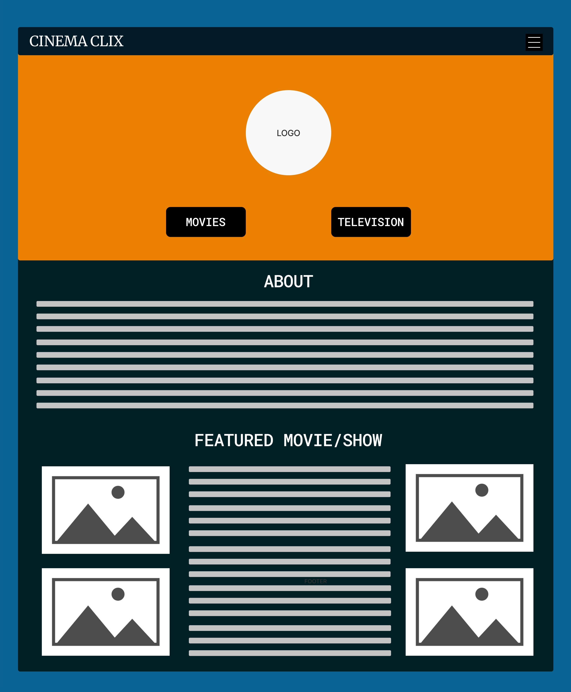
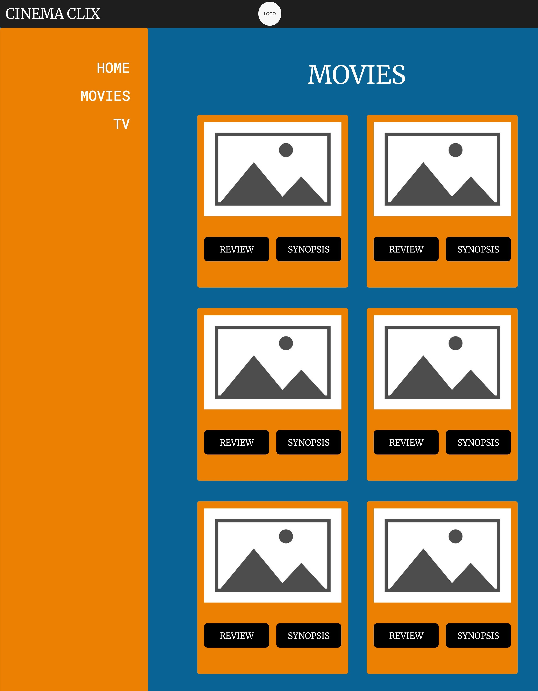
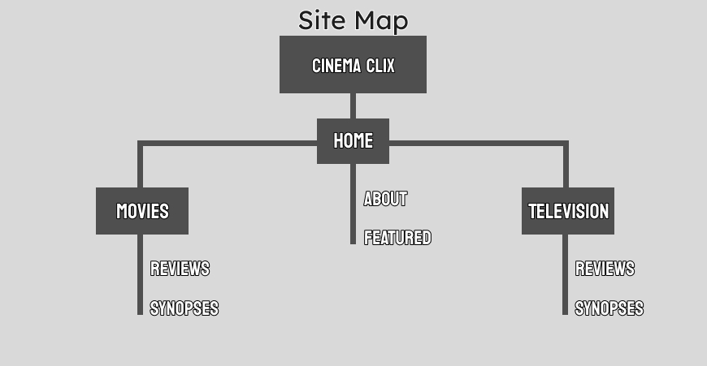

# Midterm Project Proposal

Concept: My website is going to be a collection of reviews, separated by movies and television shows, then sorted either by decade, genre, rating, etc. The main page will be where you navigate to the two other pages, one for movies and the other for television. The main page will also include a short "about" section for the site, as well as a "featured movie/show"

Website Inspiration: 
- https://crookedmarquee.com/
- https://reverseshot.org/

Concepts We Covered:
1. Box Model and Layouts (especially for images)
2. Nav Bar
3. Styles

Concepts I need to Learn:
1. Image and Text Interaction (Hover, click, etc)
2. Dropdown Menus

